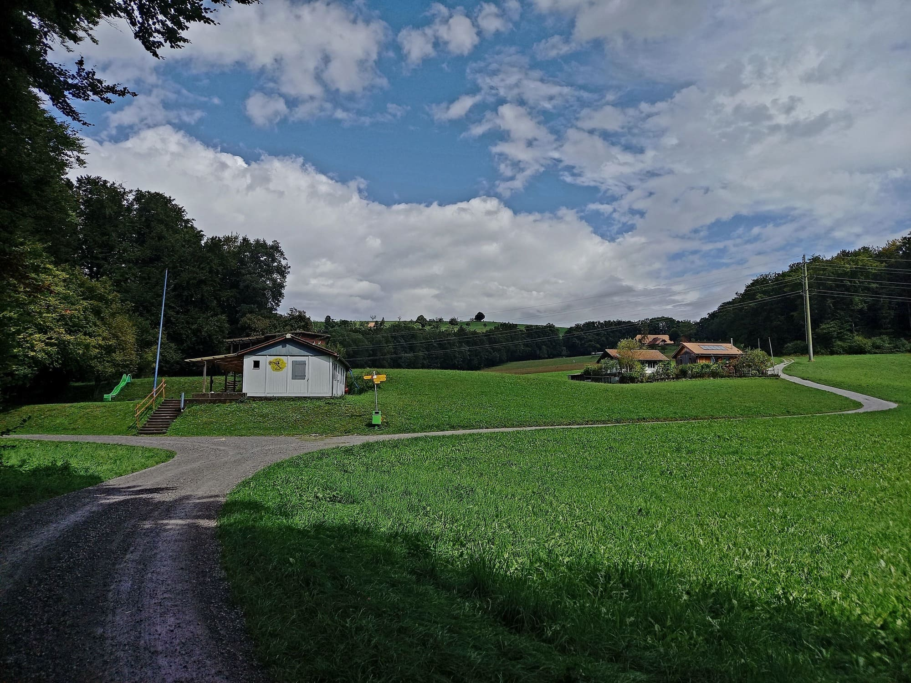
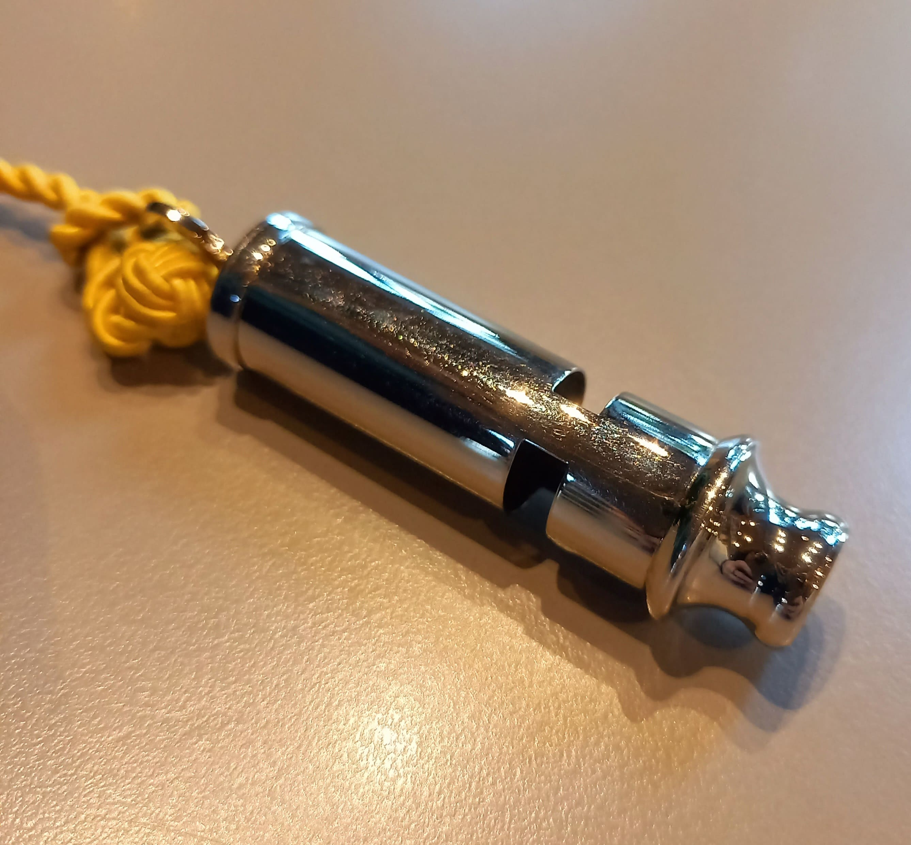
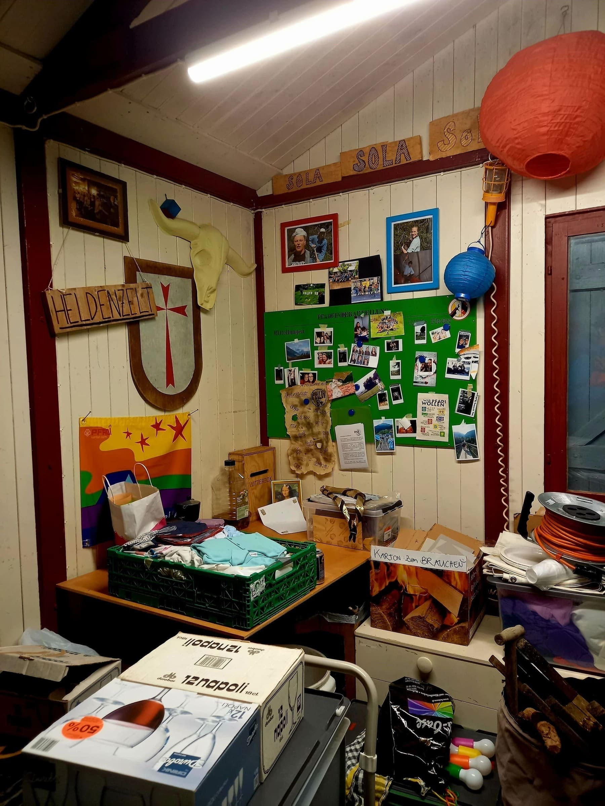
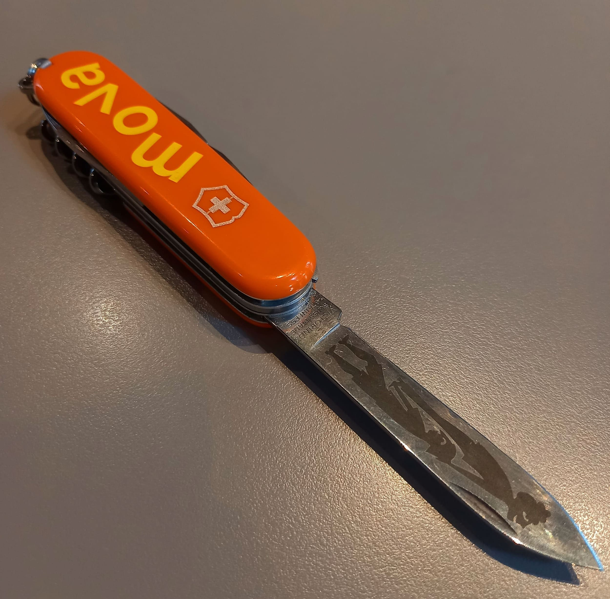

+++
title = "Pfadi fägt!"
date = "2022-12-02"
draft = false
pinned = false
image = "pexels-cottonbro-studio-9303753-2-1-.jpg"
description = "Eine Reportage über die Pfadi."
footnotes = "Von: Martina Gobbin und Gaia Isch\n\nFotos: Gaia Ischi\n\nFoto Titel: cottonbro studio"
+++



Woher kommt die Pfadi? Welche Auswirkungen hat die Pfadi auf die Pfadfinder:innen? Wir haben uns auf die Suche nach Antworten begeben.



Der Täter ist entlarvt, die Pfadfinder:innen sind glücklich. Nach zwei Stunden Schnitzeljagd machen wir uns auf den Weg zurück zum Pfadiheim, welches neben einem Feldweg auf einem Hügel liegt. Die Stimmung ist gelassen, Essen wird geteilt und zum Schluss stehen wir alle in einem Kreis, schreien einen Pfadispruch. Die gute Laune ist ansteckend, fast schon elektrisierend.

Unsere Geschichte beginnt einige Stunden davor: Als wir um zwölf beim Pfadiheim eintreffen, sind die Leiter:innen in ihre letzten Vorbereitungen für die Aktivität an diesem Samstagnachmittag vertieft. Kostüme werden zurechtgelegt, Hinweise für eine Schnitzeljagd gelegt und der Zeitplan überarbeitet. Die Kinder werden um zwei Uhr eintreffen, und bis dahin muss alles bereit sein, denn heute ist ein besonderer Tag in Worb: Es ist das Generationenfest. Im Rahmen dieses Dorffestes haben viele Leute Stände aufgestellt, um Handarbeiten, Essen und Weiteres zu verkaufen. So hat auch die Pfadi einen Informationsstand. Für die Pfadi ist das eine gute Gelegenheit, neue Mitglieder zu rekrutieren.

Sobald die Pfadfinder:innen eintreffen, starten wir mit einigen Spielen, um uns aufzuwärmen. Die Leiterin fasst die Geschehnisse des Samstages davor zusammen und erinnert die Pfadfinder:innen an ihr Ziel: Sie müssen herausfinden, wer gefälschte Mona Lisas verkauft. Dazu müssen wir ein Logical ausfüllen, die Informationen finden wir überall verstreut in Worb, eingezeichnet auf einer Karte. Das Lösen praktischer Probleme in der Wildnis und Kartenlesen sei ein wichtiger Bestandteil der Pfadi, erklärt uns unsere Interviewpartnerin Smile.

> Wie bastelt man etwas so zusammen, dass es hält?
>
> _Smile_



Unsere Interviewpartnerin (2005), Smile mit Pfadinamen, ist (nebst einer Gymnasiastin am Gymnasium Kirchenfeld) seit gut zehn Jahren begeisterte Pfadfinderin. Nach ihrem Wechsel von der Pfadi Steinbruch in die Pfadi Patria ist sie dem Mädchentrupp «Lapislazuli» beigetreten. Heute ist sie in der Roverstufe. Smile hat schon vieles bei der Pfadi erlebt und erzählt uns gerne ihre zahlreichen Geschichten aus der Pfadi.



## Der Ursprung der Pfadi

Unsere Suche nach den Anfängen der Pfadi führt uns zurück in das England von 1907. Der Londoner Robert Stephenson Smyth Baden-Powell ist General der britisch-königlichen Armee. Seine militärische Laufbahn begann er mit 19 Jahren. Seine weltweit gesammelten Erfahrungen und durchgeführten Expeditionen helfen ihm bei seiner Aufgabe, Späher – «Scouts» – auszubilden. «Geschichtlich ist die Pfadi eine Vorbereitung für den Krieg», erklärt uns Smile. Die damaligen Überzeugungen lauteten: Eine erfolgreiche Ausbildung des Nachwuchses bedarf einer autoritären Erziehung. Im starken Kontrast dazu beurteilte Baden-Powell den Grundsatz «Lernen durch Handeln» als gewinnversprechender. Er empfand es als essentiell, seinen «Scouts» zu vertrauen. Diese Erziehungsphilosophie hielt er in seinem Buch «Aids to Scouting» fest, welches einen grossen Erfolg verzeichnen konnte. Daraufhin schrieb Baden-Powell ein weiteres Buch, welches darauf abzielte, englische Jugendliche dazu zu ermutigen, ihre Umgebung zu erforschen und erkunden. Diese zwei Schriften waren die Basis für die Gründung der ersten Jugendbewegung von Scouts. 21 Jugendliche führten mit Baden-Powell, von seinen Pfadfindern liebevoll BiPi genannt, das erste Pfadilager auf Brownsea Island durch, einer kleinen Insel im Süden Englands. Die Begeisterung war gross; schon bald waren englische Jungen und Mädchen von der Pfadi verzaubert. Nach «Girl Guides» (um 1914), geschrieben von BiPi und seiner Schwester, war die Pfadi weltweit bekannt.

Auch in der Schweiz begeisterte die Pfadi schnell die Jugendlichen. 1910 wurde der erste Pfadfindertrupp für die Jungs aufgebaut. Die Mädchen gründeten nur kurz später ihre eigene Pfadi. Die Idee der Pfadi verbreitete sich in der Schweiz wie ein Lauffeuer: viele kleinere Organisationen waren verstreut über die ganze Schweiz. Um die Zusammenarbeit unter den Pfadis weiter zu fördern, wurde 1987 eine Dachorganisation gegründet, die Pfadibewegung Schweiz (PBS), welche bis heute besteht. «Die Vergangenheit \[der Pfadi] ist vielleicht nicht wirklich glorreich», meint unsere Interviewpartnerin Smile im Zusammenhang mit dem militärischen Ursprung, die Pfadibewegung Schweiz suche eine Distanzierung. So werden die wöchentlichen Treffen am Samstagmorgen «Aktivität» und nicht mehr «Übung» genannt, wie uns ein Pfadfinder am Generationenfest erklärt.

## Die Ziele und Methoden der Pfadi

Viele der heutigen Ziele der Pfadi haben ihren Ursprung noch immer in der Vision von Baden-Powell: Die Pfadiausbildung soll die Jugendlichen zu friedlichen Bürgern und funktionierenden Gliedern der Gesellschaft erziehen. Sie sollen zu verantwortlichen und unabhängigen Menschen heranwachsen.

So sind laut der Pfadibewegung Schweiz zentrale Aspekte der Pfadi eine gesunde Beziehung zu sich selbst, zu Mitmenschen und zu der Umwelt, in der man sich befindet. Die Pfadfinder:innen bewegen sich in einem Umfeld, welches sich stark von ihrem Zuhause oder der Schule unterscheidet. Durch die Pfadi entwickeln sie eine Unabhängigkeit und fördern ihre Persönlichkeit; Selbstbewusstsein und Selbstkritik stehen an erster Stelle, die Pfadfinder:innen sollen ihre Potentiale erkennen können und werden dazu motiviert, diese auszuschöpfen. Die Pfadfinder:innen, welche wir in Worb begleiten durften, sind stets aufgestellt und tatkräftig. Aufgeben gibt es nicht.

Auch die Kreativität ist ein Ziel der Pfadi. Gefördert wird die Kreativität hauptsächlich dadurch, dass die Pfadfinder:innen an vielen verschiedenen Aktivitäten teilnehmen. Lagerfeuer, das gemeinsame Singen von Pfadiliedern, Spielen, Theaterspielen, und das gemeinsame Kochen unterstützen das Zusammengehörigkeitsgefühl. «Man sollte nicht unterschätzen, wie es ist, am Abend an einem Lagerfeuer Lieder zu singen», erzählt uns Smile.

Natürlich möchte die Pfadi auch die praktischen Kompetenzen der Pfadfinder:innen aufbauen und erweitern. Kartenlesen ist ein wichtiger Bestandteil der Pfadiausbildung. Geländespiele und Orientierungsläufe unterstützen dieses Ziel. Das Meistern des Kartenlesens ist grundlegend für unsere besuchte Pfadiaktivität: Die Aufgabe können die Pfadfinder:innen nicht lösen, wenn sie die Informationen für das Logical nicht finden.

Weiter werden praktische Fähigkeiten wie das Bauen, Tierspurensuchen oder Wandern miteinbezogen. Die Pfadi möchte den Pfadfinder:innen eine gesunde Beziehung zur Natur nahelegen. «Wie bastelt man etwas so zusammen, dass es hält?», merkt Smile an. Praktisches Denken in der Natur sei fundamental für die Pfadi.

Die Beziehung zum eigenen Körper ist auch ein wichtiger Aspekt der Pfadi: Die Pfadfinder:innen verbringen viel Zeit draussen, im Wald, in der Natur. Entsprechend des zunehmenden Bewusstseins für den Klimaschutz haben auch die Pfadis ihre Prioritäten angepasst. Der Umwelt- und Klimaschutz ist ein zentrales Thema.

Weiter hat die Inklusivität einen hohen Stellenwert in der Pfadi. Smile berichtet, dass es die «Pfadi trotz allem» für gehbehinderte oder anderweitig beeinträchtigte Pfadfinder:innen gibt. Darüber hinaus gibt es in Bern die «Pfasyl» für Asylsuchende, welche gerne an den Pfadiaktivitäten teilnehmen möchten. Schon vor siebzig Jahren habe es eine «Pfadi trotz allem» für die Jungs gegeben. Die Mädchen mussten noch einige Jahrzehnte auf eine eigene «Pfadi trotz allem» warten. Das Pfadigesetz, formuliert von BiPi selbst, fördert diese weltoffenen Ansichten und Werte. Pfadis halten sich weltweit an dieses Gesetz und haben es über die Jahre den sozialen Entwicklungen angepasst. Das Pfadigesetz sagt: Die Pfadfinder:innen sollen offen und ehrlich sein, Freude verbreiten, hilfsbereit und verantwortungsvoll sein, teilen und Sorge tragen.

Zusätzlich ist der Pfadi die Gemeinschaft bedeutsam. Der Kontakt zur regionalen Bevölkerung ist dabei von Bedeutung: Die Pfadi organisiert Feste, Flohmärkte und andere Veranstaltungen. Ein Beispiel dafür ist das Generationenfest in Worb, das wir im Rahmen unseres Besuches bei der Pfadi Worb besuchen durften.

> Die Pfadi ist ein gutes Werkzeug, welches man das ganze Leben lang dabei hat.
> 
> _Smile_



In der Schweiz organisiert die Pfadibewegung Schweiz (PBS) nationale Anliegen wie Ausbildungskurse oder eine gute Vernetzung auf internationaler Ebene. Kantonalverbände kümmern sich um die Organisation innerhalb der Kantone und die Mitwirkung auf nationaler Ebene. Die lokalen Pfadis sind zuständig für das Programm am Samstagnachmittag und für die Pfadilager. Die Pfadi umfasst mehrere Stufen; das Programm ist an die jeweilige Altersgruppe angepasst.



## Die Pfadierfahrung als Werkzeug

«Jeder nimmt etwas anderes mit, aber etwas nimmt man sicher mit», behauptet Smile in unserem Interview. Doch was sind nun die positiven Auswirkungen der Pfadi? Smile erzählt von einem Erlebnis eines Leiters. Als Sechzehnjähriger habe er ohne jegliche Einwände eine Lehre angefangen. Derselbe Lehrmeister, der ihn eingestellt habe, habe einen zwanzigjährigen Gymnasiasten jedoch nicht eingestellt. Dieser sei zu jung und habe keine Lebenserfahrung. Auf die Frage des Pfadileiters, wieso der Lehrmeister ihn eingestellt habe, erhielt er diese Antwort: «Weil du ein Pfadfinder bist.» Smile meint weiter, dass die Pfadi ein gutes Werkzeug für den Rest ihres Lebens sei.

Studien unterstützen diese Aussage. Eine schottische Studie zeigt, dass nur wenige ehemalige Pfadfinder:innen im Erwachsenenalter an Depressionen oder Angststörungen erkranken. Der Wissenschaftler Richard M. Lerner führte eine Umfrage mit Programmführer der «Boy-Scouts of America», welche die positiven Effekte der Pfadi einschätzen mussten. Die Resultate waren eindeutig: Die Leiter glaubten an positiven Auswirkungen. Unter anderem wurde die akademische Leistung als erhöht eingeschätzt.

Smile berichtet, dass die Abwechslung in der Natur, die ihr die Pfadi bieten kann, ihre Produktivität fördert. Sie erwähnt weiter, dass die Erfolgserlebnisse in der Pfadi das Selbstbewusstsein steigern können. Ein Beispiel dafür sei eine siebenstündige Wanderung gewesen, die sie gemeinsam mit ihren Pfadfinder:innen absolviert habe: «Man fühlt sich stolz, dass man etwas erreicht hat.»

Eine Studie der Tufts University zeigt ferner, dass die Vertrauenswürdigkeit in Pfadfinder:innen (im Vergleich zu einer Testgruppe von Nicht-Pfadfinder:innen) stark erhöht ist. Dies erklärt Smile mit der zunehmenden Verantwortung, die Pfadfinder:innen in ihrem Pfadileben übernehmen müssen. Auf der Stufe der Leiter (mit ungefähr 17 Jahren) lernt man das Programm zu organisieren und die Pfadfinder:innen zu leiten.

Die Erweiterung der sozialen Kompetenzen sei laut Smile klar bemerkbar. In den Aktivitäten am Samstagnachmittag löst man gemeinsam Probleme, was die Pfadfinderinnen und Pfadfinder zusammenschweisst. Die gemeinschaftliche Stimmung, die durch das anschliessende Teilen von mitgebrachtem Essen entsteht, erfahren wir an eigenem Leibe. Die Vertrautheit ist klar spürbar, als wir uns langsam dem Ende unseres Pfadibesuches nähern. Ein letztes Mal stehen wir alle in einem grossen Kreis, wir werfen unsere Hände in die Höhe und schreien: “Pfadi Worb!” Es ist nun fünf Uhr nachmittags und immer mehr Eltern trudeln ein, um ihre Kinder von der Pfadi abzuholen. Auch wir machen uns auf den Heimweg, unsere Eindrücke des Pfadinachmittags begleiten uns. «Dieses Zusammenleben ist etwas, was ich so nicht an vielen anderen Orten erlebt habe», meint Smile.

## Zu guter Letzt

Smile hat uns von vielen schönen Momenten in der Pfadi erzählt – von der Geselligkeit, von der harten Arbeit, von ihren Erkenntnissen. Pfadfinderin zu sein, gehöre zu ihrer Lebenseinstellung, meint sie. Auch wir bleiben berührt von unserem Erlebnis in der Pfadi, denn sie vermittelte uns eine Sorglosigkeit, ein simples «Sein», ohne Vorurteile oder Bedingungen. Was man letztendlich unbedingt über die Pfadi wissen muss? «Pfadi fägt!»
